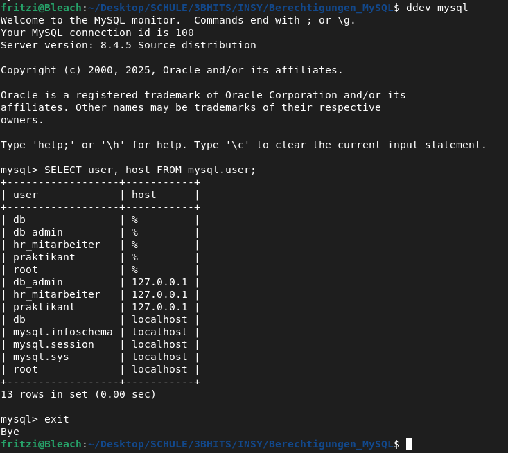
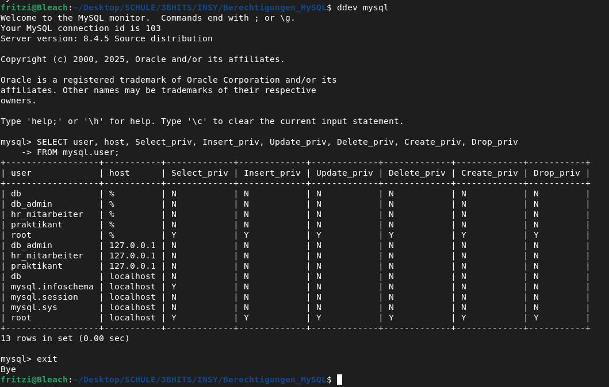
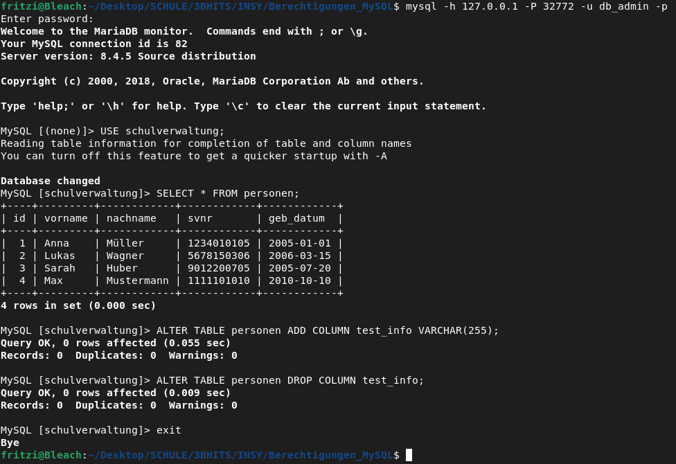
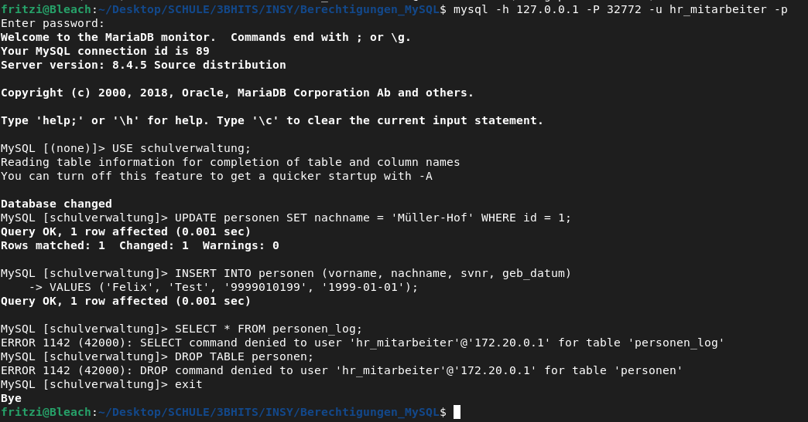
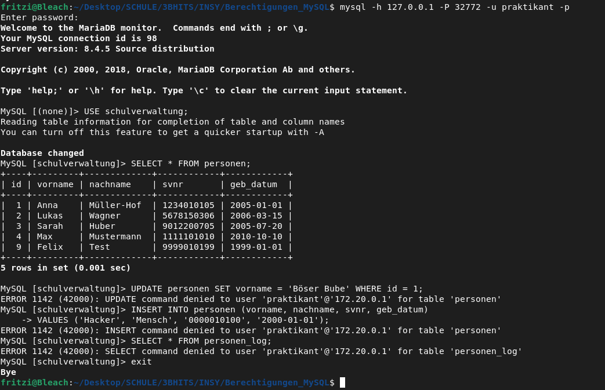

# Berechtigungen in MySQL

## DB erstellen

```bash
ddev config
```

### vim .ddev/config.yaml

In diesem File die Datenbank und Version von **mariadb -> mysql** und **11.8 -> 8.4**

## zur Datenbank “verbinden”

```bash
ddev mysql
```

### alle User und deren Passwörter erstellen

```mysql
CREATE USER 'db_admin'@'127.0.0.1' IDENTIFIED BY 'Einfach123!';
CREATE USER 'db_admin'@'%' IDENTIFIED BY 'Einfach123!';
```

```mysql
CREATE USER 'hr_mitarbeiter'@'127.0.0.1' IDENTIFIED BY 'Einfach123!';
CREATE USER 'hr_mitarbeiter'@'%' IDENTIFIED BY 'Einfach123!';
```

```mysql
CREATE USER 'praktikant'@'127.0.0.1' IDENTIFIED BY 'Einfach123!';
CREATE USER 'praktikant'@'%' IDENTIFIED BY 'Einfach123!';
```

```mysql
FLUSH PRIVILEGES;
```



### Berechtigungen vergeben

```mysql
GRANT ALL PRIVILEGES ON schulverwaltung.* TO 'db_admin'@'127.0.0.1';
GRANT ALL PRIVILEGES ON schulverwaltung.* TO 'db_admin'@'%';
```

```mysql
GRANT SELECT, INSERT, UPDATE, DELETE ON schulverwaltung.personen TO 'hr_mitarbeiter'@'127.0.0.1';
GRANT SELECT, INSERT, UPDATE, DELETE ON schulverwaltung.personen TO 'hr_mitarbeiter'@'%';
```

```mysql
GRANT SELECT ON schulverwaltung.personen TO 'praktikant'@'127.0.0.1';
GRANT SELECT ON schulverwaltung.personen TO 'praktikant'@'%';
```

```mysql
FLUSH PRIVILEGES;
```



## Berechtigungen testen

```mysql
USE schulverwaltung;
```

### db_admin

```bash
mysql -h 127.0.0.1 -P 32772 -u db_admin -p
```

**Test A**

```mysql
SELECT * FROM personen;
```

**Test B**

```mysql
ALTER TABLE personen ADD COLUMN test_info VARCHAR(255);
ALTER TABLE personen DROP COLUMN test_info;
```



### hr_mitarbeiter

```bash
mysql -h 127.0.0.1 -P 32772 -u hr_mitarbeiter -p
```

**Test A**

```mysql
UPDATE personen SET nachname = 'Müller-Hof' WHERE id = 1;
```

**Test B**

```mysql
INSERT INTO personen (vorname, nachname, svnr, geb_datum) 
VALUES ('Felix', 'Test', '9999010199', '1999-01-01');
```

**Test C**

```mysql
SELECT * FROM personen_log;
```

**Test D**

```mysql
DROP TABLE personen;
```



### praktikant

```bash

```

**Test A**

```mysql
SELECT * FROM personen;
```

**Test B**

```mysql
UPDATE personen SET vorname = 'Böser Bube' WHERE id = 1;
```

**Test C**

```mysql
INSERT INTO personen (vorname, nachname, svnr, geb_datum) 
VALUES ('Hacker', 'Mensch', '0000010100', '2000-01-01');
```

**Test D**

```mysql
SELECT * FROM personen_log;
```



