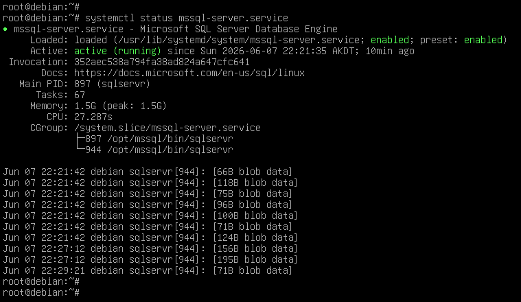
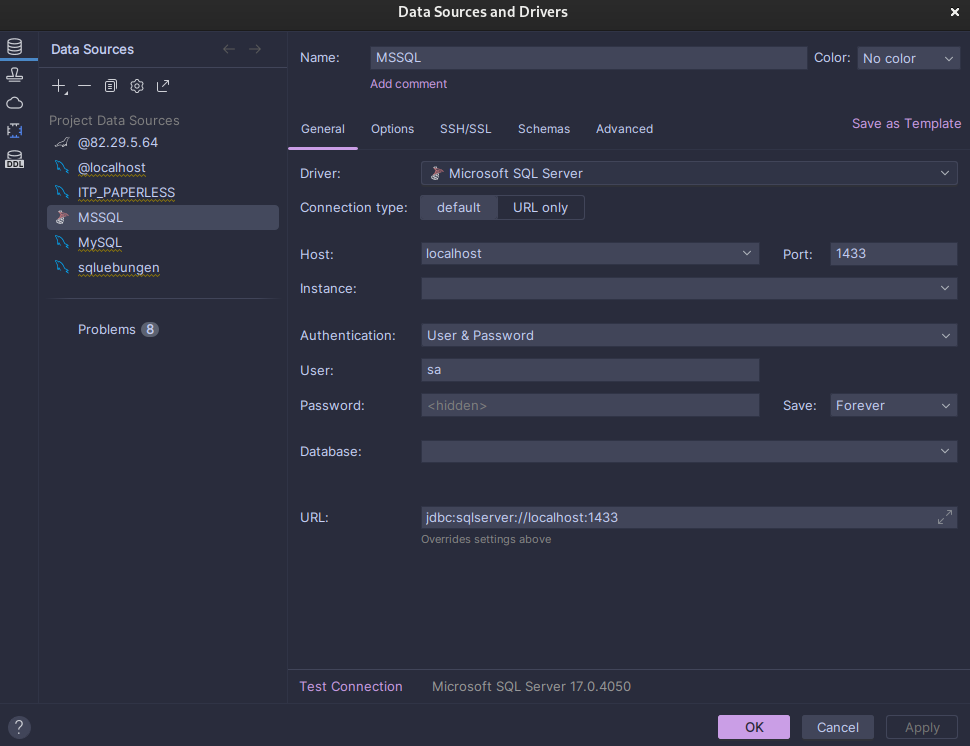
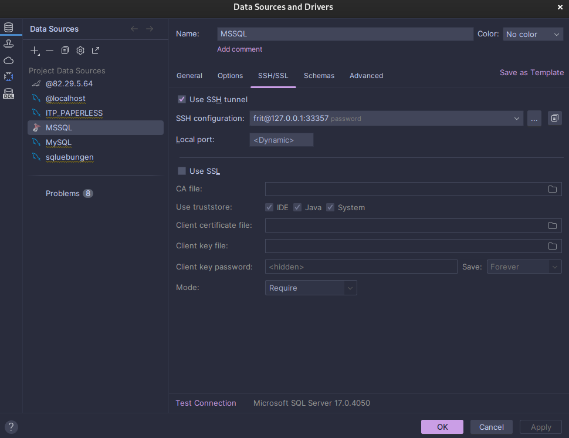
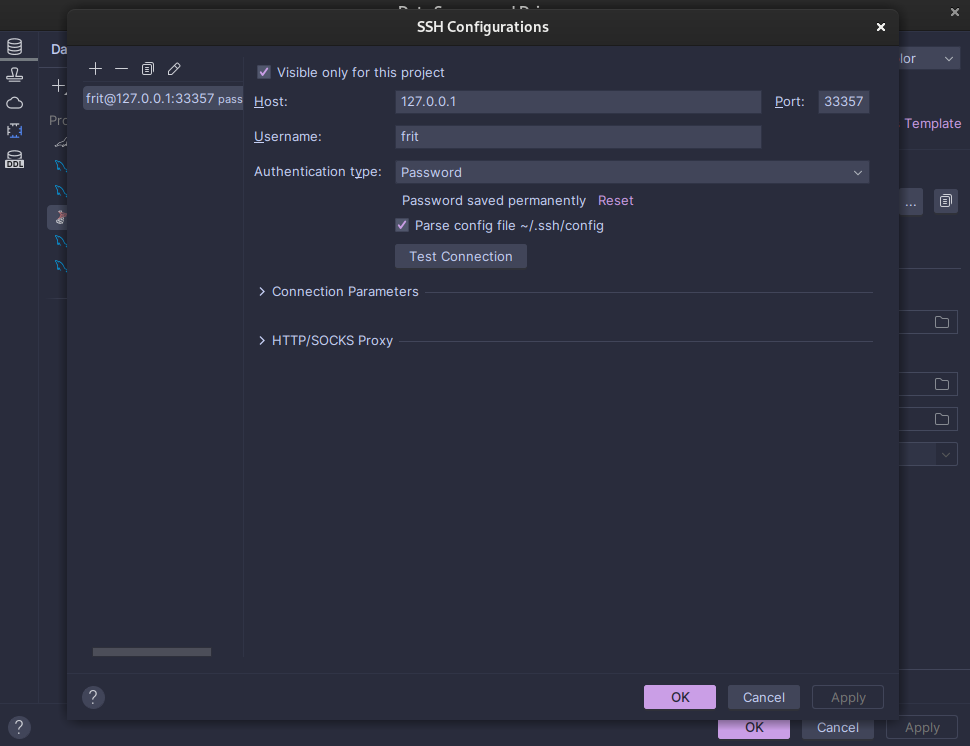
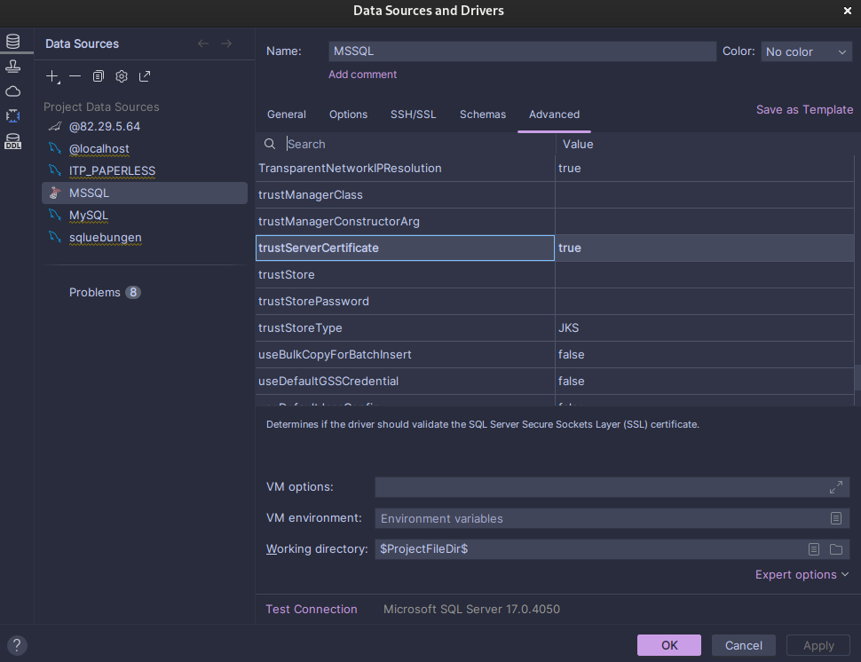

## 1. Installation auf einer Debian VM

1. **Repository hinzufügen & installieren:**

   ```bash
   # Microsoft GPG-Schlüssel importieren
   https://packages.microsoft.com/keys/microsoft.asc | sudo tee /etc/apt/trusted.gpg.d/microsoft.asc
   
   # Ubuntu 22.04 Repository hinzufügen (Beispiel)
   add-apt-repository "$(curl https://packages.microsoft.com/config/ubuntu/22.04/mssql-server-2022.list)"
   
   # Installieren
   apt update || apt upgrade
   apt install mssql-server -y
   ```

2. **Konfiguration starten:**

   ```bash
   /opt/mssql/bin/mssql-conf setup
   ```

3. **Status prüfen:**

   ```bash
   systemctl status mssql-server
   ```



## 2. studyorganizer migraten

**das Projekt hat sich zerschossen (oder vielleicht wars auch ich)**

## 3. Datagrip







