# Aufgabenstellungen 

## Einfache SELECTs & WHERE-Bedingungen
* Zeige alle Spalten aus der Tabelle mitarbeiter an.

  ```sql
  SELECT * FROM mitarbeiter;
  ```

  

* Zeige nur den Vor- und Nachnamen aller Mitarbeiter an.

  ```sql
  SELECT vorname, nachname FROM mitarbeiter;
  ```

  

* Finde alle Mitarbeiter, die ein Gehalt von mehr als 4000 verdienen.

  ```sql
  SELECT * FROM mitarbeiter WHERE gehalt > 4000;
  ```

  

* Zeige alle Abteilungen an, die ihren Standort in 'Berlin' haben.

  ```sql
  SELECT * FROM abteilung WHERE standort = 'Berlin';
  ```

  

* Finde alle Projekte, deren Budget zwischen 5000 und 20000 liegt.

  ```sql
  SELECT * FROM projekt WHERE 5000 < budget AND budget < 20000;
  ```
  
  

## JOINS 
* Zeige den Vor- und Nachnamen aller Mitarbeiter sowie den Namen ihrer Abteilung an.

  ```sql
  SELECT vorname, nachname, abteilung.abt_name FROM mitarbeiter JOIN abteilung ON mitarbeiter.abt_id = abteilung.abt_id;
  ```

  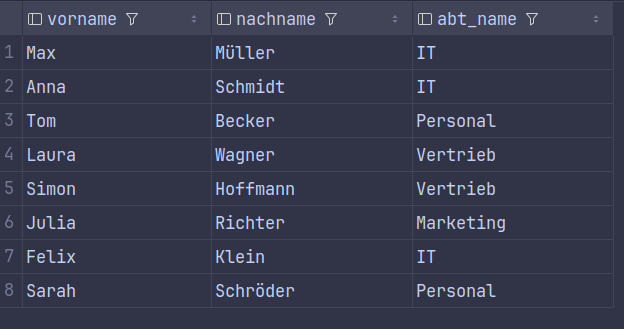

* Welche Mitarbeiter (Vorname, Nachname) arbeiten am Standort 'München'?

  ```sql
  SELECT vorname, nachname, abteilung.standort FROM mitarbeiter JOIN abteilung ON mitarbeiter.abt_id = abteilung.abt_id WHERE abteilung.standort = 'München';
  ```

  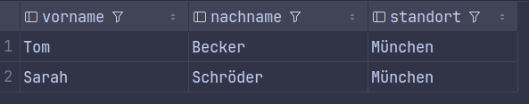

* Zeige alle Abteilungen und deren Mitarbeiter an. Auch Abteilungen ohne Mitarbeiter sollen in der Liste erscheinen.

  ```sql
  SELECT abt_name, mitarbeiter.vorname, mitarbeiter.nachname FROM abteilung LEFT JOIN mitarbeiter ON abteilung.abt_id = mitarbeiter.abt_id;
  ```

  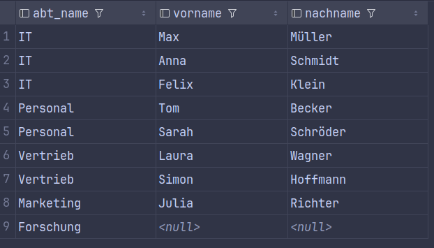

* Liste alle Mitarbeiter auf, die am Projekt mit der ID 10 arbeiten (Zeige Vorname, Nachname und die investierten Stunden).

  ```sql
  SELECT vorname, nachname, stunden FROM mitarbeiter JOIN mitarbeiter_projekt ON mitarbeiter.ma_id = mitarbeiter_projekt.ma_id WHERE mitarbeiter_projekt.proj_id = '10';
  ```

  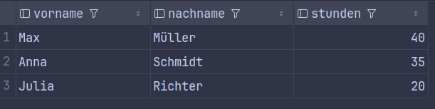

* Zeige den Projekttitel, den Nachnamen des Mitarbeiters und die Stunden für alle Projektzuordnungen an.

  ```sql
  SELECT titel, mitarbeiter.nachname AS Mitarbeiter, mitarbeiter_projekt.stunden FROM projekt JOIN mitarbeiter_projekt./ ON projekt.proj_id = mitarbeiter_projekt.proj_id JOIN mitarbeiter ON mitarbeiter_projekt.ma_id = mitarbeiter.ma_id;
  ```

  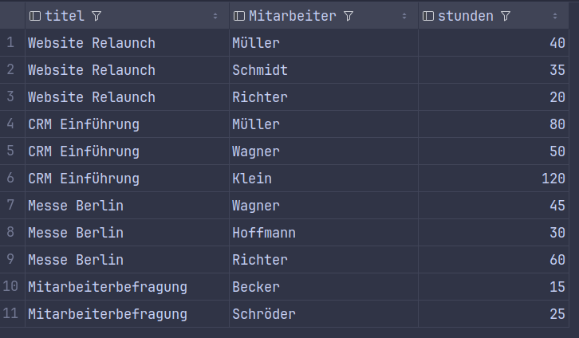

## GROUP BY & Aggregatfunktionen
* Wie viele Mitarbeiter arbeiten in der gesamten Firma? .

  ```sql
  SELECT COUNT(ma_id) FROM mitarbeiter;
  ```

  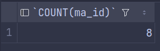

* Ermittle das durchschnittliche Gehalt aller Mitarbeiter .

  ```sql
  SELECT AVG(gehalt) FROM mitarbeiter;
  ```

  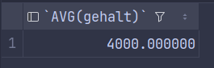

* Zähle, wie viele Mitarbeiter in jeder Abteilung arbeiten. Zeige die Abteilungs-ID und die Anzahl an .

  ```sql
  SELECT abt_id, COUNT(ma_id) FROM mitarbeiter GROUP BY abt_id;
  ```

  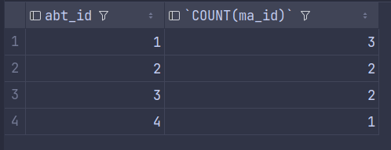

* Berechne das durchschnittliche Gehalt pro Abteilung (Zeige Abteilungs-ID und Durchschnittsgehalt).

  ```sql
  SELECT abt_id, AVG(gehalt) FROM mitarbeiter GROUP BY abt_id;
  ```

  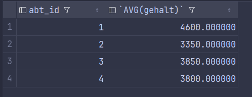

* Wie viele Stunden wurden insgesamt für das Projekt mit der ID 20 aufgewendet?

  ```sql
  SELECT SUM(stunden) FROM mitarbeiter_projekt WHERE proj_id = 20;
  ```

  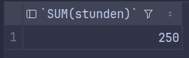

## Kombinationen (JOIN + WHERE + GROUP BY + HAVING)
* Zeige den Namen jeder Abteilung und die Anzahl der dortigen Mitarbeiter an.

  ```sql
  SELECT abteilung.abt_name, COUNT(mitarbeiter.ma_id) FROM abteilung LEFT JOIN mitarbeiter ON abteilung.abt_id = mitarbeiter.abt_id GROUP BY abteilung.abt_id, abteilung.abt_name;
  ```

  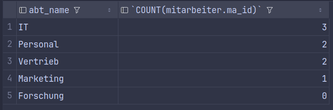

* Welche Abteilungen haben mehr als 2 Mitarbeiter?

  ```sql
  SELECT abteilung.abt_name, COUNT(mitarbeiter.ma_id) FROM abteilung JOIN mitarbeiter ON abteilung.abt_id = mitarbeiter.abt_id GROUP BY abteilung.abt_id, abteilung.abt_name HAVING COUNT(mitarbeiter.ma_id) > 2;
  ```

  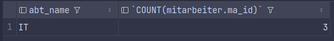

* Berechne die Gesamtsumme der investierten Stunden pro Projekttitel.

  ```sql
  SELECT projekt.titel, SUM(mitarbeiter_projekt.stunden) FROM projekt JOIN mitarbeiter_projekt ON projekt.proj_id = mitarbeiter_projekt.proj_id GROUP BY projekt.proj_id, projekt.titel;
  ```

  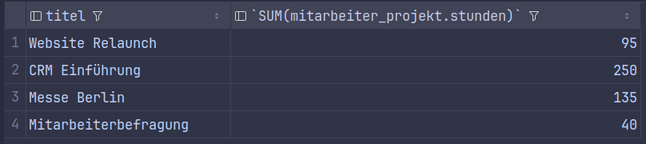

* Zeige das durchschnittliche Gehalt pro Abteilung an (mit Abteilungsnamen), aber berücksichtige für den Durchschnitt nur Mitarbeiter, die mehr als 3000 verdienen.

  ```sql
  SELECT abteilung.abt_name, AVG(mitarbeiter.gehalt) FROM abteilung JOIN mitarbeiter ON abteilung.abt_id = mitarbeiter.abt_id WHERE mitarbeiter.gehalt > 3000 GROUP BY abteilung.abt_id, abteilung.abt_name;
  ```

  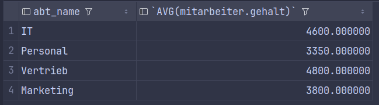

* Finde heraus, an wie vielen verschiedenen Projekten jeder Mitarbeiter arbeitet. Zeige den Nachnamen des Mitarbeiters und die Anzahl seiner Projekte, sortiert nach der höchsten Projektanzahl.

  ```sql
  SELECT mitarbeiter.nachname, COUNT(mitarbeiter_projekt.proj_id) FROM mitarbeiter JOIN mitarbeiter_projekt ON mitarbeiter.ma_id = mitarbeiter_projekt.ma_id GROUP BY mitarbeiter.ma_id, mitarbeiter.nachname ORDER BY COUNT(mitarbeiter_projekt.proj_id) DESC;
  ```

  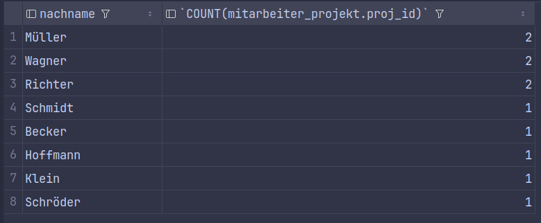

