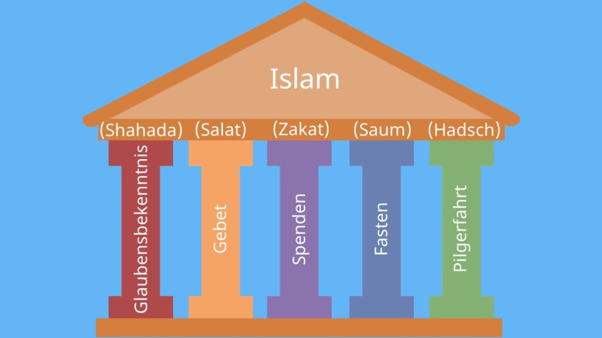

# ISLAM

## Dritte abrahamitische Religion - ISLAM

**Geschichtlicher Überblick:** 

* 610: Muhammad empfängt Offenbarung Gottes
* 622: Hidschra: Auswanderung nach Medina
* 630: Muhammad zieht nach Kampf in Mekka ein
* 632: Muhammad stirbt in Medina
* 632-750: 
  * Islam breitet sich aus
  * Eroberung Jerusalems | Spaniens bis zu den Pyrenäen
  * ab 8. Jh. Sufismus
* 1096-1270: 7 Kreuzzüge, um das Hl Land von den Muslimen zu befreien
* 1453: Eroberung Konstantinopels
* 15, Jhdt - 1918: mehrere unabhängige islamische Staaten/Reiche
* 16, Ab 1970: Ausbreitung/reformerischer/fundamentalistischer Tendenzen in mehreren islamischen Ländern

## [3_5Säulen.pdf](3_5Säulen.pdf)

1. Schahada (Glaubensbekenntnis): Bekenntnis zu dem einen Gott (Allah) und seinem Propheten Mohammed.
2. Salat (Pflichtgebet): Fünf tägliche Gebete in Richtung Mekka nach einer rituellen Waschung.
3. Zakat (Almosensteuer): Eine jährliche Abgabe (ca. 2,5 bis 10 %) an Bedürftige als religiöse Reinigung des Vermögens.
4. Saum (Fasten): Verzicht auf Essen, Trinken und Rauchen von der Morgendämmerung bis Sonnenuntergang im Monat Ramadan.
5. Haddsch (Pilgerfahrt): Einmalige Reise nach Mekka zur Kaaba, sofern Gesundheit und Finanzen es erlauben.