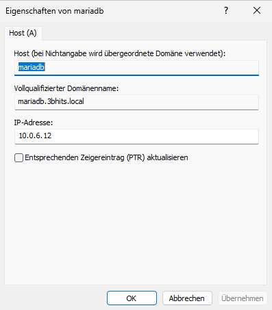

# Dokumentation: MariaDB Server

## 1. MariaDB Server installieren

### MariaDB installieren

```bash
apt install mariadb-server
```

### Dienst starten und aktivieren

```bash
systemctl start mariadb
systemctl enable mariadb # sodass die datenbank beim booten auch startet
```

## 2. Installation absichern

```bash
mariadb-secure-installation
```

## 3. Remote-Zugriff konfigurieren

### Konfigurationsdatei bearbeiten

```bash
vim /etc/mysql/mariadb.conf.d/50-server.cnf # bind-address = 0.0.0.0
```

### Dienst neu starten

```bash
systemctl restart mariadb
```

## 4. Remote-Benutzer erstellen

```bash
mariadb -u root -p
```

```mariadb
GRANT ALL PRIVILEGES ON *.* TO 'admin'@'%' IDENTIFIED BY 'einfach';
FLUSH PRIVILEGES;
```

## 5. DNS-Eintrag hinzufügen

Damit der Server unter `mariadb.3bhits.local` erreichbar ist, muss die Zone angepasst werden.



## 6. Test am Client

### DNS-Auflösung prüfen

```bash
dig mariadb.3bhits.local
```

### Verbindung testen

```bash
mariadb -h mariadb.3bhits.local -u admin -p
```
