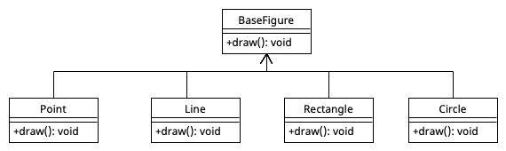

# Vererbung - super

Zum Ausführen der ursprünglichen Methode in der abgeleiteten Klasse wird in der der überschreibenden Methode das Schlüsselwort "super" verwendet.

``````java
class BaseClass {
		public Baseclass() {
				System.out.println("Code in BaseClass#BaseClass");
		}
  
		public void method() {
				System.out.println("Code in BaseClass#method");
		}
  
		public String otherMethod() {
		}
}
``````

``````java
class SubClass extends BaseClass {
		public SubClass() {
				super();
				// zusätzliches Verhalten:
				System.out.println("Code in Subclass#SubClass");
		}
  
  	@Override
  	public void method() {
      	super.method();
      	// zusätzliches Verhalten:
      	System.out.println("Code in SubClass#method");
    }
  
  	public String additionalMethod() {
      	// zusätzliches Verhalten
    }
  
  	SubClass sb = new SubClass();
  	sb.method();
}
``````

---

#  Vererbung - abstrakte Methoden



> Problem: Was soll eine draw-Methode bei einer nicht konkreten geometrischen Figur (Base Figure) zeichnen?
>
> Man könnte eine leere Methode einfügen, dies führt zu der Poblematik, dass die Klasse instanzierbar ist, obwohl es nicht sinnvoll ist, da die geometrische Form nicht festgelegt ist.

Genau für solche Fälle eignen sich abstrakte Basisklassen. Diese erlauben es, Methoden vorzugeben, die von Subklassen zu implementieren sind.

Dazu nutzt man Methoden ohne Implementierung. Diese besitzen deswegen auch keinen Block mit Programmzeilen, allerdings eine spezielle Kennzeichnung durch das Schlüsselwort abstract. Man spricht auch von abstrakten Methoden.

``````java
public abstract class BaseFigure {
  	public abstract void draw();
  	public void otherMethod() {
      	// ...
    }
}
``````

``````java
public class Rect extends BaseFigure {
  	public void draw() {
      	// Code zum zeichnen eines Rechtecks
    }
}
``````

``````java
public class Circle extends BaseFigure {
  	public void draw() {
      	// Code zum zeichnen eines Rechtecks
    }
}
``````

# Interfaces (Schnittstellen)

Während bei Vererbung eine Spezialisierung abgebildet wird (z.B. Circle ist eine Spezialisierung von BaseFigure) wird durch Interfaces eine zusätzliche Funktionalität bereitgestellt (z.B. Geometrische Form kann vergrößert werden)

Da eine Klasse mehrere Funktionalitäten besitzen kann, können mehrere Interfaces implementiert werden.

Mit einem Interface wird für ein Objekt beschrieben, was es kann. Im Gegensatz dazu wird mit Vererbung für ein Objekt beschrieben, was es ist. 

<u>Beispiel:</u>

``````java
interface Resizeable {
		public abstract void resize();
}
``````

``````java
class Circle implements Resizeable {
	public void resize () {
		// ...
	}
}
``````

